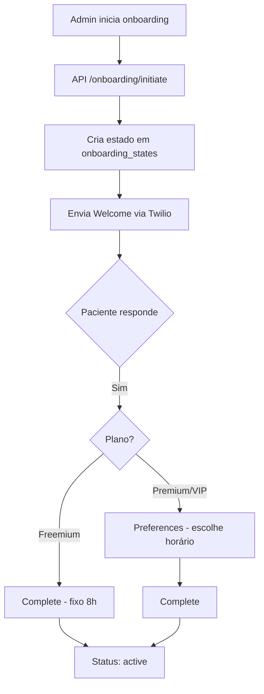

# 📖 CUIDAR.ME — Documentação Mestre

**Versão:** 1.0 | **Última atualização:** 05/03/2026 20:27 — v1.5.2  
**Objetivo:** Este é o documento de referência definitivo do Cuidar.me. Toda idealização, regras de negócio, arquitetura técnica, estado atual de implementação e histórico de correções estão aqui. Deve ser atualizado a cada sprint ou mudança significativa.

---

## Índice

1. [Idealização e Visão do Produto](#1-idealização-e-visão-do-produto)
2. [Os 3 Planos de Assinatura](#2-os-3-planos-de-assinatura)
3. [Protocolos Clínicos](#3-protocolos-clínicos)
4. [Gamificação e Recompensas](#4-gamificação-e-recompensas)
5. [Fluxos Operacionais](#5-fluxos-operacionais)
6. [Inteligência Artificial](#6-inteligência-artificial)
7. [Arquitetura Técnica](#7-arquitetura-técnica)
8. [Mapa de Arquivos](#8-mapa-de-arquivos)
9. [Banco de Dados (Supabase)](#9-banco-de-dados-supabase)
10. [Segurança e Resiliência](#10-segurança-e-resiliência)
11. [Deploy e Infraestrutura](#11-deploy-e-infraestrutura)
12. [Estado Atual vs Idealizado](#12-estado-atual-vs-idealizado)
13. [Histórico de Correções](#13-histórico-de-correções)
14. [Boas Práticas e Organização](#14-boas-práticas-e-organização)
15. [Documentos Relacionados](#15-documentos-relacionados)

---

## 1. Idealização e Visão do Produto

### O que é o Cuidar.me?

O **Cuidar.me** é um **Personal Health Companion** que vive no WhatsApp do paciente. Não é um chatbot passivo — é um sistema **proativo** que:

- Acompanha a rotina do paciente via check-ins diários
- Envia lembretes e dicas de saúde personalizadas
- Coleta dados de saúde (peso, água, alimentação, exercício, sono)
- Oferece suporte emocional e informativo via IA
- Recompensa bons comportamentos com **gamificação** (pontos, níveis, badges)
- Escala situações de risco para a equipe humana

### A Missão

> Garantir que o paciente **nunca se sinta sozinho ou desmotivado** em sua jornada de saúde, usando a conveniência do WhatsApp e a inteligência da IA para criar um **jogo engajador** de transformação pessoal.

### Estratégia de Negócio: PLG (Product Led Growth)

O produto é desenhado para que o valor percebido escale naturalmente:

```
  🥉 Freemium          🥈 Premium              🥇 VIP
  "A Semente"          "O Companheiro"          "O Concierge"
  ──────────────────────────────────────────────────────────
  Awareness            Habit Building           Total Care
  Broadcast only       Proativo + Interativo    Hiper-Personalizado
  R$0                  R$29,90/mês (sugestão)   R$79,90/mês (sugestão)
```

---

## 2. Os 3 Planos de Assinatura

### Tabela Comparativa

| Feature | 🥉 Freemium | 🥈 Premium | 🥇 VIP |
|---------|-------------|------------|---------|
| **Preço sugerido** | R$ 0 | R$ 29,90/mês | R$ 79,90/mês |
| Dica diária (8h) | ✅ Genérica | ✅ Personalizada | ✅ Personalizada |
| Check-in consolidado (20h) | ❌ | ✅ | ✅ |
| Chat com IA | ❌ (upsell) | ✅ 30 msgs/dia | ✅ Ilimitado |
| Protocolos | ❌ | ✅ Personalizados | ✅ Elite |
| Gamificação | ❌ | ✅ Completa | ✅ + Exclusiva |
| Escalação humana | ❌ | Normal | ⭐ Prioritária |
| Escolha de horário | ❌ (fixo 8h) | ✅ | ✅ |
| **Custo operacional** | ~R$ 0,24/mês | ~R$ 2,50/mês | ~R$ 5,00/mês |

### 🥉 Freemium — "A Semente"

**Filosofia:** *"Eu te dou um presente toda manhã."*

- **Objetivo:** Aquisição massiva e captura de Lead (WhatsApp)
- **O que tem:** Cadastro rápido + 1 Dica Diária genérica (8h, cron job)
- **O que NÃO tem:** Chat com IA, check-ins, gamificação, protocolos
- **Limite:** 5 msgs/dia. Qualquer mensagem do paciente dispara **upsell para Premium**
- **Onboarding:** Welcome → "Sim" → Complete (pula preferências, fixo 8h manhã)

### 🥈 Premium — "O Companheiro"

**Filosofia:** *"Eu te ajudo a não desistir."*

- **Objetivo:** Retenção, Educação e Mudança de Comportamento
- **O que tem:** Chat IA (30 msgs/dia), check-ins diários (20h), protocolos, gamificação completa
- **Onboarding:** Welcome → "Sim" → Preferências (Manhã/Tarde/Noite) → Complete

### 🥇 VIP — "O Concierge"

**Filosofia:** *"Eu cuido de absolutamente tudo."*

- **Objetivo:** Ticket alto, Hiper-personalização, Suporte Humano
- **O que tem:** Tudo do Premium + Chat ilimitado + Escalação prioritária + Protocolos elite
- **Onboarding:** Welcome → "Sim" → Preferências → Complete

---

## 3. Protocolos Clínicos

A jornada Cuidar.me é um funil evolutivo: **Fundamentos ➔ Evolução ➔ Performance**.

### 🌱 Nível 1: Fundamentos (30-90 dias)

| Aspecto | Detalhe |
|---------|---------|
| **Metáfora** | "Limpando o terreno e plantando as primeiras sementes" |
| **Persona** | Sedentário, sobrepeso, sobrecarregado de informação |
| **Foco** | Hidratação + 1 refeição limpa/dia + caminhadas leves |
| **Tom da IA** | Acolhedor, perdoador (Modo Maternal) |
| **Gamificação** | Fácil — muitos pontos por tarefas simples (dopamina barata) |

### 📈 Nível 2: Evolução (90 dias)

| Aspecto | Detalhe |
|---------|---------|
| **Metáfora** | "Cuidando do jardim e podando os excessos" |
| **Persona** | Já saiu da inércia, mas sofre efeito sanfona |
| **Foco** | Qualidade do prato + treino 3-4x/semana + sono + hidratação |
| **Tom da IA** | Parceria intelectual (Modo Professor) |
| **Gamificação** | Média — exige combos de dias seguidos |

### 🔥 Nível 3: Performance (90 dias)

| Aspecto | Detalhe |
|---------|---------|
| **Metáfora** | "Esculpindo a obra de arte" |
| **Persona** | Focado, competitivo, atingiu platô |
| **Foco** | Macronutrientes exatos + treino 5x+/semana + sono de recuperação |
| **Tom da IA** | Treinador de Elite (Coach Esportivo, sem desculpas) |
| **Gamificação** | Hard — perde pontos ao falhar, badges por semanas 100% |

---

## 4. Gamificação e Recompensas

### Economia de Pontos

Um paciente disciplinado acumula **80-100 pts/dia**:
- 1 Mês Perfeito: ~2.500-3.000 pts
- 1 Ciclo de 90 Dias: ~8.000-9.000 pts

### Ações e Pontuação

| Ação | Pontos |
|------|--------|
| Check-in completo | +50 pts |
| Hidratação correta | +15 pts |
| Alimentação 100% (A) | +20 pts |
| Atividade Física | +30 pts + 1/min |
| Pesagem Semanal | +50 pts |

### Níveis de Resgate

| Nível | Pontos | Recompensa |
|-------|--------|------------|
| 🥉 Bronze (Desbravador) | 1.500 | E-book Premium + Badge |
| 🥈 Prata (Consistente) | 4.000 | Masterclass + Cupom 10-15% |
| 🥇 Ouro (Atleta) | 8.000 | Camiseta exclusiva + 15min com médica |
| 💎 Diamante (Lenda) | 15.000+ | Livro físico + 50% desc. renovação anual |

### Sistema de Streaks

- Dias consecutivos de check-in acumulam **streaks**
- **Streak Freeze:** 2 proteções/mês (perdoa 1 dia perdido)
- Streaks longos desbloqueiam badges especiais

### Mecânica Anti-Fraude

- Check-ins via WhatsApp são seguros (dependem do cron enviar)
- Botões manuais no Dashboard têm **cooldown** + teto diário

---

## 5. Fluxos Operacionais

### 🚀 Onboarding WhatsApp



**Arquivos envolvidos:**
- `src/app/api/onboarding/initiate/route.ts` — API que dispara
- `src/ai/onboarding.ts` — Lógica de steps e mensagens
- `src/ai/actions/onboarding.ts` — Processamento de respostas

### 📅 Dica Diária Freemium (Cron 8h)

- **Arquivo:** `src/cron/send-freemium-tips.ts`
- **Rota:** `src/app/api/cron/send-freemium-tips/route.ts`
- **Banco:** 7 dicas rotativas em `src/lib/quotes.ts`

### 📅 Check-in Diário (Premium/VIP)

- **Arquivo:** `src/cron/send-daily-checkins.ts` + `src/ai/daily-checkin.ts`
- **Rota:** `src/app/api/cron/send-daily-checkins/route.ts`
- **Perspectivas:** Hidratação, Alimentação, Exercício, Bem-Estar

### 📋 Protocolos de Saúde

- **Dados:** `src/lib/data/protocols.ts` (definição) + `src/lib/data/gamification-steps.ts`
- **Processamento:** `src/ai/protocol-response-processor.ts`
- **Handler:** `src/ai/handlers/gamification-handler.ts`

### 📨 Recebimento de Mensagens (Webhook Twilio) - Arquitetura Desacoplada

Para evitar timeouts de 10s no plano Vercel Hobby, a arquitetura de recebimento foi **desacoplada**:

```mermaid
graph TD
    A[WhatsApp msg] --> B[/api/whatsapp POST]
    B --> C[validateTwilioWebhook]
    C --> D[Salva em message_queue 'pending']
    B -->|Retorna 200 OK imediato| E[Twilio]
    D --> F[Dispara /api/process-queue assíncrono]
    F -->|waitUntil| G[handlePatientReply (IA Backend)]
    G --> H{Opt-out?}
    H -->|SAIR| I[opt-out-handler]
    H -->|Não| J{Onboarding ativo?}
    J -->|Sim| K[handleOnboardingReply]
    J -->|Não| L{Primeiro contato?}
    L -->|Sim| M[welcome-handler]
    L -->|Não| N{Freemium?}
    N -->|Sim| O{Emergência?}
    O -->|Sim| P[safety-msg]
    O -->|Não| Q[upsell Premium]
    N -->|Não| R[Classificar Intenção IA]
    R --> S{Intenção}
    S -->|Emergency| T[emergency-handler]
    S -->|Social| U[Resposta rápida]
    S -->|Check-in| V[gamification-handler]
    S -->|Outro| W[conversation-handler IA]
```

**Arquivos principais:** 
- `src/app/api/whatsapp/route.ts` (Webhook rápido O(1))
- `src/app/api/process-queue/route.ts` (Background Worker protegido com token)
- `src/ai/handle-patient-reply.ts` (Orquestrador central de regras de negócio)

### 🎬 Vídeos Educacionais

O Cuidar.me possui uma **biblioteca de vídeos educacionais** segmentada por plano. Os vídeos são cadastrados pelo admin e filtrados automaticamente para exibir apenas conteúdos elegíveis ao plano do paciente.

- **Cadastro:** Admin cadastra vídeos com título, descrição, URL (YouTube/Vimeo), categoria e `eligible_plans`
- **Exibição:** Portal do Paciente (`/portal/education`) mostra apenas vídeos cujo `eligible_plans` inclui o plano do paciente
- **Feedback:** Pacientes podem dar like/dislike em vídeos assistidos (tabela `sent_videos`)
- **Componentes:** `video-card.tsx` (card do vídeo), `video-player.tsx` (player embeddado)
- **Admin:** Tela de gerenciamento em `(dashboard)/education/`

**Arquivos envolvidos:**

| Arquivo | Função |
|---------|--------|
| `src/ai/actions/videos.ts` | CRUD de vídeos + filtro por plano |
| `src/components/video-card.tsx` | Card de exibição |
| `src/components/video-player.tsx` | Player de vídeo |
| `src/app/portal/education/page.tsx` | Página do paciente |
| `src/app/(dashboard)/education/page.tsx` | Gestão pelo admin |

### 🫂 Comunidade Anônima

Espaço seguro onde pacientes podem interagir anonimamente, compartilhar experiências e se apoiar mutuamente. Cada paciente recebe um **username gerado automaticamente** (baseado no primeiro nome) para manter o anonimato.

- **Tópicos:** Pacientes criam tópicos com título e texto
- **Comentários:** Outros pacientes podem comentar nos tópicos
- **Fixados:** Admin pode fixar tópicos importantes (pinned)
- **Moderação:** Admin pode deletar tópicos e comentários
- **Username:** Gerado automaticamente na primeira interação (`ensureCommunityUsername`)

**Tabelas:**
- `community_topics` — Tópicos (author_id, author_username, title, text, is_pinned, comment_count)
- `community_comments` — Comentários (topic_id, author_id, author_username, text)

**Arquivos envolvidos:**

| Arquivo | Função |
|---------|--------|
| `src/ai/actions-extended.ts` | CRUD de tópicos e comentários |
| `src/app/portal/community/page.tsx` | Listagem (paciente) |
| `src/app/portal/community/[id]/page.tsx` | Detalhes do tópico |
| `src/app/(dashboard)/community/page.tsx` | Gestão (admin) |
| `src/app/(dashboard)/community/[id]/page.tsx` | Detalhes (admin) |

### 🧪 Exames Laboratoriais (Lab Results)

O sistema processa **exames laboratoriais via IA** (Gemini Vision). O profissional faz upload da imagem do exame, a IA extrai os valores e compara com faixas de referência, gerando alertas automáticos quando necessário.

**Dados extraídos automaticamente:**
- Glicemia (jejum), HbA1c
- Colesterol Total, LDL, HDL, Triglicerídeos
- Creatinina, Ureia (Função renal)
- ALT, AST (Função hepática)
- TSH, T4 (Tireoide)
- Vitamina D, Vitamina B12

**Fluxo de processamento:**
1. Upload da imagem do exame pelo admin
2. IA (Gemini Vision) extrai valores via `extract-lab-results` flow
3. Valores são salvos na tabela `lab_results`
4. Se houver valores alterados: cria `attention_request`, marca paciente como `needs_attention`, envia alerta via WhatsApp
5. Se todos normais: envia mensagem de confirmação

**Arquivos envolvidos:**

| Arquivo | Função |
|---------|--------|
| `src/ai/actions/lab-results.ts` | Processamento e alertas |
| `src/ai/flows/extract-lab-results.ts` | Extração via Gemini Vision |
| Tabela `lab_results` | Armazenamento |

### 📊 Acompanhamento de Saúde (Peso, Métricas e Evolução)

O paciente pode registrar **métricas de saúde** diretamente no Dashboard, e o sistema traça a evolução ao longo do tempo com gráficos.

**Métricas rastreadas:**
- **Peso** — Registro manual (semanal), com cálculo de IMC automático
- **Hidratação** — Via check-in diário (WhatsApp) ou botão no portal
- **Alimentação** — Via check-in (A=100%, B=Adaptei, C=Fugi)
- **Exercício** — Duração em minutos + tipo
- **Bem-estar** — Escala 1-5 emojis

**Check-ins diários (via WhatsApp):**
- O cron envia check-ins consolidados às 20h (Premium/VIP)
- As respostas são parseadas e salvas na tabela `daily_checkins`
- Cada check-in gera pontos de gamificação

**Componentes de visualização:**

| Componente | Função |
|------------|--------|
| `health-metrics-chart.tsx` | Gráfico de evolução (peso, IMC) |
| `gamification-display.tsx` | Painel de pontos e nível |
| `streak-display.tsx` | Visualização de streaks |
| `streak-badge.tsx` | Badge visual de streak |
| `hydration-button.tsx` | Botão rápido de hidratação |
| `quick-action-button.tsx` | Botões de ação rápida |
| `patient-analysis-panel.tsx` | Painel de análise do paciente |
| `level-progress.tsx` | Barra de progresso do nível |

**Tabelas envolvidas:**
- `daily_checkins` — Check-ins diários (água, alimentação, exercício, humor)
- `health_metrics` — Métricas avulsas (peso, glicose, pressão)
- `gamification` — Estado de pontos, XP, nível
- `lab_results` — Resultados laboratoriais

**Portal do Paciente — Páginas:**
- `/portal/journey` — Visualização da jornada e progresso
- `/portal/achievements` — Conquistas e badges desbloqueados
- `/portal/store` — Loja para trocar pontos por recompensas
- `/portal/profile` — Perfil com histórico de métricas

---

## 6. Inteligência Artificial

### Stack de IA

- **Modelo:** Google Gemini via Genkit SDK (`src/ai/genkit.ts`)
- **Uso:** Geração de respostas, classificação de intenção, extração de dados, sumarização

### Flows (Pipelines de IA)

| Flow | Arquivo | Função |
|------|---------|--------|
| `generate-chatbot-reply` | `src/ai/flows/` | Gera resposta da IA ao paciente |
| `generate-patient-summary` | `src/ai/flows/` | Resumo do estado do paciente |
| `extract-patient-data` | `src/ai/flows/` | Extrai dados estruturados da conversa |
| `extract-lab-results` | `src/ai/flows/` | Extrai resultados laboratoriais |
| `get-chat-analysis` | `src/ai/flows/` | Análise conversacional |
| `suggest-whatsapp-replies` | `src/ai/flows/` | Sugere respostas ao profissional |
| `generate-protocol` | `src/ai/flows/` | Gera protocolo personalizado |
| `analyze-patient-conversation` | `src/ai/flows/` | Análise profunda de conversa |

### Classificador de Intenção

**Arquivo:** `src/ai/message-intent-classifier.ts`

Classifica cada mensagem em: `EMERGENCY`, `SOCIAL`, `CHECKIN_RESPONSE`, `QUESTION`, `OFF_TOPIC`

---

## 7. Arquitetura Técnica

### Stack

| Camada | Tecnologia |
|--------|-----------|
| **Framework** | Next.js 14 (App Router) |
| **Linguagem** | TypeScript |
| **Banco de Dados** | Supabase (PostgreSQL + Realtime) |
| **Autenticação** | Supabase Auth |
| **IA** | Google Genkit + Gemini |
| **Mensageria** | Twilio (WhatsApp Business API) |
| **UI** | Tailwind CSS + shadcn/ui |
| **Forms** | React Hook Form + Zod |
| **Deploy** | Vercel |
| **Cron Jobs** | Vercel Cron |

### Padrões Arquiteturais

- **Server Actions** (`'use server'`) para operações do banco
- **API Routes** para webhooks externos (Twilio, Crons)
- **Barrel Exports** (`src/ai/actions.ts` re-exporta tudo)
- **Handler Pattern** para roteamento de mensagens (`src/ai/handlers/`)
- **Service Role Client** para operações privilegiadas server-side

---

## 8. Mapa de Arquivos

```
Cuidar-me/
├── src/
│   ├── app/                          # Rotas Next.js (App Router)
│   │   ├── (dashboard)/              # Painel Admin (route group)
│   │   │   ├── overview/             # Visão geral
│   │   │   ├── patients/             # Lista de pacientes
│   │   │   ├── patient/[id]/         # Perfil do paciente
│   │   │   ├── protocols/            # Gestão de protocolos
│   │   │   ├── campaigns/            # Campanhas
│   │   │   ├── community/            # Comunidade (admin)
│   │   │   ├── education/            # Vídeos educacionais
│   │   │   ├── admin/                # Configurações admin
│   │   │   ├── plans/                # Gestão de planos
│   │   │   └── layout.tsx            # Layout do dashboard
│   │   ├── portal/                   # Portal do Paciente
│   │   │   ├── welcome/              # Tela de boas-vindas
│   │   │   ├── profile/              # Perfil do paciente
│   │   │   ├── journey/              # Jornada/Progresso
│   │   │   ├── achievements/         # Conquistas
│   │   │   ├── community/            # Comunidade (paciente)
│   │   │   ├── education/            # Vídeos
│   │   │   ├── store/                # Loja de pontos
│   │   │   ├── plans/                # Planos disponíveis
│   │   │   └── layout.tsx            # Layout do portal
│   │   ├── dashboard/                # Roteador central de roles
│   │   ├── api/
│   │   │   ├── whatsapp/route.ts     # Webhook Twilio
│   │   │   ├── onboarding/initiate/  # API de onboarding
│   │   │   └── cron/                 # Cron jobs
│   │   ├── privacidade/              # Política de privacidade
│   │   ├── page.tsx                  # Landing page / Login
│   │   └── layout.tsx                # Root layout
│   ├── ai/                           # Motor de IA
│   │   ├── actions/                  # Server Actions (CRUD)
│   │   ├── flows/                    # Pipelines de IA (Genkit)
│   │   ├── handlers/                 # Handlers de mensagens
│   │   ├── handle-patient-reply.ts   # Orquestrador central
│   │   ├── onboarding.ts            # Lógica de onboarding
│   │   ├── daily-checkin.ts          # Lógica de check-in
│   │   ├── message-intent-classifier.ts
│   │   ├── protocol-response-processor.ts
│   │   ├── actions.ts               # Barrel re-exports
│   │   ├── actions-extended.ts       # Actions estendidas
│   │   ├── genkit.ts                # Config Genkit
│   │   └── seed-database.ts         # Seed de dados
│   ├── components/                   # Componentes React
│   │   ├── ui/                       # shadcn/ui (37 componentes)
│   │   ├── AppLayout.tsx             # Layout principal
│   │   ├── chat-panel.tsx            # Painel de chat
│   │   ├── patient-edit-form.tsx     # Formulário de paciente
│   │   ├── gamification-display.tsx  # Display de gamificação
│   │   ├── streak-display.tsx        # Display de streaks
│   │   └── ...                       # Demais componentes
│   ├── lib/                          # Utilitários
│   │   ├── data/                     # Dados estáticos
│   │   │   ├── protocols.ts          # Definição de protocolos
│   │   │   ├── gamification-config.ts
│   │   │   ├── gamification-steps.ts
│   │   │   └── seed-data.ts          # Dados de seed
│   │   ├── supabase-*.ts             # 5 clients Supabase
│   │   ├── twilio.ts                 # Client Twilio
│   │   ├── types.ts                  # Tipos TypeScript
│   │   ├── level-system.ts           # Sistema de níveis
│   │   ├── badge-*.ts                # Sistema de badges (3 arquivos)
│   │   ├── streak-system.ts          # Sistema de streaks
│   │   ├── rate-limit.ts             # Rate limiting
│   │   └── ...                       # Demais utilitários
│   ├── cron/                         # Lógica dos cron jobs
│   ├── hooks/                        # React Hooks
│   ├── scripts/                      # Scripts de manutenção
│   └── services/                     # Serviços
├── scripts/                          # Scripts auxiliares
│   ├── _archive/                     # Scripts antigos (arquivados)
│   └── *.ts                          # Scripts ativos
├── supabase/migrations/              # Migrações SQL (14 arquivos)
├── docs/                             # Documentação
│   ├── archive/                      # Docs históricos
│   └── *.md                          # Docs ativos
├── tests/                            # Testes automatizados
├── GOLDEN-RULES.md                   # Regras de Ouro (imutável)
├── APP-FULL-DESCRIPTION.md           # Descrição completa
└── README.md                         # Guia de setup
```

---

## 9. Banco de Dados (Supabase)

### Tabelas Principais

| Tabela | Função |
|--------|--------|
| `users` | Perfis de usuário (role, email, display_name) |
| `patients` | Cadastro de pacientes (nome, whatsapp, plano, status) |
| `messages` | Histórico de mensagens (sender, text, twilio_sid) |
| `onboarding_states` | Estado do onboarding (step, plan, data, completed_at) |
| `patient_protocols` | Protocolos ativos por paciente |
| `protocols` | Definição de protocolos |
| `gamification` | Estado de gamificação por paciente |
| `health_metrics` | Métricas de saúde (peso, glicose, etc.) |
| `scheduled_messages` | Fila de mensagens agendadas |
| `attention_requests` | Alertas de atenção (escalados pela IA) |
| `daily_checkins` | Check-ins diários |
| `lab_results` | Resultados laboratoriais |
| `transactions` | Transações de pontos (loja) |
| `community_topics` | Tópicos da comunidade |
| `community_comments` | Comentários da comunidade |
| `message_queue` | Fila assíncrona de webhooks do Twilio (evita timeout na Vercel) |

### Schema da Tabela `message_queue`

```sql
-- Colunas: id, whatsapp_number, message_text, profile_name, message_sid (UNIQUE),
--          status ('pending'|'processing'|'completed'|'error'), error_log,
--          created_at, updated_at
-- Índice GIN: idx_message_queue_status_pending (status, created_at)
```

### Schema da Tabela `messages`

```sql
-- Colunas: id, patient_id, sender ('patient'|'me'|'system'), text, 
--          twilio_sid, metadata, created_at
```

### Schema da Tabela `onboarding_states`

```sql
-- Colunas: id, patient_id, step ('welcome'|'preferences'|'complete'),
--          plan, data (jsonb), completed_at, created_at, updated_at
```

---

## 10. Segurança e Resiliência

- **Rate Limiting:** Freemium 5/dia, Premium 30/dia, VIP ilimitado
- **Webhook Validation:** Assinatura Twilio validada em cada request
- **Idempotência:** `twilio_sid` previne duplicação de mensagens
- **Supabase RLS:** Row Level Security em todas as tabelas
- **Service Role:** Operações privilegiadas isoladas no server
- **Fila de Mensagens:** `scheduled_messages` com retry automático
- **Números de teste:** Proteção contra envio a números de seed
- **Emergências:** Detecção por keyword + IA com escalação automática

---

## 11. Deploy e Infraestrutura

| Item | Serviço |
|------|---------|
| **Hosting** | Vercel (Hobby/Pro) |
| **Database** | Supabase Cloud |
| **WhatsApp** | Twilio (Sandbox ou BYON) |
| **IA** | Google AI (Gemini API) |
| **DNS** | Via Vercel |
| **Cron Jobs** | Vercel Cron (`vercel.json`) |

### Variáveis de Ambiente Necessárias

```
NEXT_PUBLIC_SUPABASE_URL
NEXT_PUBLIC_SUPABASE_ANON_KEY
SUPABASE_SERVICE_ROLE_KEY
GOOGLE_GENAI_API_KEY
TWILIO_ACCOUNT_SID
TWILIO_AUTH_TOKEN
TWILIO_PHONE_NUMBER
NEXT_PUBLIC_APP_URL
```

---

## 12. Estado Atual vs Idealizado

### ✅ Implementado e Funcionando

| Feature | Status |
|---------|--------|
| Onboarding WhatsApp (3 planos) | ✅ Funcional |
| Dica diária Freemium (cron 8h) | ✅ Funcional |
| Chat IA (Premium/VIP) | ✅ Funcional |
| Freemium Gate (upsell) | ✅ Funcional |
| Rate Limiting por plano | ✅ Funcional |
| Detecção de emergência | ✅ Funcional |
| Gamificação (pontos, níveis, badges) | ✅ Funcional |
| Streaks | ✅ Funcional |
| Protocolos clínicos (3 níveis) | ✅ Funcional |
| Dashboard Admin | ✅ Funcional |
| Portal do Paciente | ✅ Funcional |
| Comunidade Anônima | ✅ Funcional |
| Vídeos Educacionais | ✅ Funcional |
| Loja de Pontos | ✅ Funcional |
| Opt-out (SAIR) | ✅ Funcional |
| Formulário de edição de paciente | ✅ Funcional |
| Autenticação (Supabase Auth) | ✅ Funcional |
| Roles (admin, equipe_saude, assistente, paciente, pendente) | ✅ Funcional |

### 🟡 Parcialmente Implementado

| Feature | Nota |
|---------|------|
| Check-in consolidado (20h) | Cron existe, mas depende de protocolo ativo |
| Relatórios VIP | Analytics básico, sem relatórios automatizados |
| Dica personalizada (manhã) | Usa banco de dicas, não IA |
| Templates Twilio | Content API parcialmente configurada |

### 🔴 Idealizado mas Pendente

| Feature | Nota |
|---------|------|
| Loja com resgate real | UI existe, backend de resgate não implementado |
| Trial Premium (7 dias) | Mencionado na estratégia, não implementado |
| Notificação push | Não implementado (PWA apenas parcial) |
| Áudio/Voz no WhatsApp | Idealizado para Premium, não implementado |
| Relatórios PDF | Idealizado para VIP, não implementado |

---

## 13. Histórico de Correções

### v1.5.2 — 05/03/2026 (20:27)

| Correção | Arquivo(s) | Causa Raiz |
|----------|-----------|------------|
| **Estabilização de Modelos Gemini** | `genkit.ts`, `*.ts` (flows) | Erro 404 em `gemini-2.0-flash`. Fixado para `flash-latest` e `pro-latest`. |
| **Fix Lógica do Botão "Sugerir"** | `chat-panel.tsx` | Falha ao buscar última mensagem do paciente quando havia mensagens de sistema. |
| **Refinamento de Fluxo de Chat** | `handle-patient-reply.ts` | Automação de interações sociais vs. escalonamento de emergências. |

### v1.5.1 — 04/03/2026

| Correção | Arquivo(s) | Causa Raiz |
|----------|-----------|------------|
| **Formulário não fechava ao salvar pendente** | `patient/[id]/page.tsx` | Loop de dependência: `isEditModalOpen` no array de deps do `useCallback` |
| **Onboarding não aparecia no chat** | `actions/onboarding.ts`, `route.ts` | Mapeamento incorreto de colunas (`sender_type`/`content` vs `sender`/`text`) |
| **"Sim" não avançava onboarding** | `actions/onboarding.ts`, `handle-patient-reply.ts` | `.single()` falhava com múltiplos registros + `patient.fullName` em vez de `patient.full_name` |
| **Limpeza do projeto** | Raiz inteira | ~83 arquivos obsoletos removidos, docs reorganizados |

### Versões Anteriores

| Versão | Data | Correções Notáveis |
|--------|------|---------------------|
| v1.5.0 | 04/03/2026 | Refatoração de gamificação (níveis Bronze→Diamante) |
| v1.4.x | 03/03/2026 | Deploy Vercel, fix autenticação Supabase |
| v1.3.x | 02/2026 | Migração Firebase → Supabase completa |
| v1.2.x | 01/2026 | Implementação de PWA, comunidade anônima |
| v1.1.x | 12/2025 | Onboarding WhatsApp, opt-out (SAIR) |
| v1.0.0 | 11/2025 | MVP inicial: chat IA + protocolos |

---

## 14. Boas Práticas e Organização

### ✅ O Que Já Segue Boas Práticas

| Prática | Implementação |
|---------|--------------|
| **App Router (Next.js 14)** | Uso correto de route groups, layouts, server components |
| **Server Actions** | Separação clara entre client e server (`'use server'`) |
| **Separação de Concerns** | `ai/handlers/` para lógica, `ai/flows/` para IA, `ai/actions/` para CRUD |
| **Barrel Exports** | `actions.ts` centraliza re-exports |
| **TypeScript Strict** | Tipos bem definidos em `lib/types.ts` |
| **shadcn/ui** | Componentes consistentes e reutilizáveis |
| **Supabase RLS** | Segurança em nível de row |
| **Migrações SQL** | Versionamento de schema em `supabase/migrations/` |
| **Teste de fluxo** | Scripts de simulação em `scripts/` |

### 🟡 Oportunidades de Melhoria

| Item | Recomendação |
|------|-------------|
| **Testes unitários** | `tests/unit/` existe mas cobertura é baixa. Priorizar `handle-patient-reply.ts` |
| **CI/CD** | Sem pipeline de testes automáticos no push |
| **Monitoramento** | Sentry configurado mas sem alertas automáticos |
| **Documentação inline** | `JSDoc` presente em alguns arquivos, falta padronizar |
| **Environment schemas** | Validar env vars com Zod na inicialização |
| **Error boundaries** | Faltam error boundaries em componentes React |

### Estrutura de Pastas — Avaliação

A organização atual é **boa e segue os padrões do Next.js 14 App Router**:

- ✅ `src/app/` para rotas (correto para App Router)
- ✅ `src/components/` separado de pages
- ✅ `src/lib/` para utilitários
- ✅ `src/ai/` para toda lógica de IA (padrão do Genkit)
- ✅ `src/hooks/` para hooks customizados
- ✅ Route Groups `(dashboard)` para agrupar rotas do admin

**Não recomendo** reorganizar a estrutura atual. Ela já está alinhada com as convenções da comunidade Next.js e facilita a navegação para qualquer desenvolvedor familiarizado com o App Router.

---

## 15. Documentos Relacionados

| Documento | Localização | Descrição |
|-----------|-------------|-----------|
| [Regras de Ouro](../GOLDEN-RULES.md) | Raiz | Definições imutáveis do produto |
| [Descrição Completa](../APP-FULL-DESCRIPTION.md) | Raiz | Visão funcional do app |
| [README](../README.md) | Raiz | Guia de setup e configuração |
| [Product Tiers](./PRODUCT-TIERS.md) | docs/ | Estratégia detalhada de planos |
| [Gamification Analysis](./GAMIFICATION_ANALYSIS.md) | docs/ | Análise do sistema de gamificação |
| [Protocol Analysis](./PROTOCOL_CLINICAL_ANALYSIS.md) | docs/ | Análise clínica dos protocolos |
| [API Reference](./API.md) | docs/ | Referência de APIs |
| [Vercel Deploy](./VERCEL_DEPLOY.md) | docs/ | Guia de deploy |
| [Cost Estimation](./COST-ESTIMATION.md) | docs/ | Estimativa de custos operacionais |
| [Logs, Auditoria e LGPD](./LOGS_AUDITORIA_LGPD.md) | docs/ | Sistema de logs, trilha de auditoria, compliance LGPD (Fases 1–3 em produção, 4–5 pendentes) |

---

*Este documento é a referência máxima do projeto Cuidar.me. Atualize-o sempre que houver mudanças significativas.*
